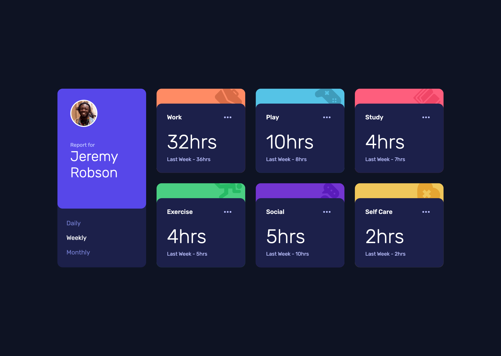

# Frontend Mentor - Time tracking dashboard solution

This is a solution to the [Time tracking dashboard challenge on Frontend Mentor](https://www.frontendmentor.io/challenges/time-tracking-dashboard-UIQ7167Jw). Frontend Mentor challenges help you improve your coding skills by building realistic projects.

## Table of contents

- [Overview](#overview)
  - [The challenge](#the-challenge)
  - [Screenshot](#screenshot)
  - [Links](#links)
- [My process](#my-process)
  - [Built with](#built-with)
- [Author](#author)

## Overview

### The challenge

Users should be able to:

- View the optimal layout for the site depending on their device's screen size
- See hover states for all interactive elements on the page
- Switch between viewing Daily, Weekly, and Monthly stats

### Screenshot
* Desktop

* Mobile

### Links

- Solution URL: [Time Tracking Dashboard using NextJS](https://www.frontendmentor.io/solutions/time-tracking-dashboard-using-nextjs-FWWEadYqy)
- Live Site URL: [Time Tracking Dashboard](https://time-tracking-dashboard-hanseonglee.vercel.app)

## My process

### Built with

- Semantic HTML5 markup
- CSS custom properties
- Flexbox
- CSS Grid
- Mobile-first workflow
- [React](https://reactjs.org/) - JS library
- [Next.js](https://nextjs.org/) - React framework
- [Sass/SCSS](https://sass-lang.com/) - For styles

## Author

- Frontend Mentor - [@HanSeongLee](https://www.frontendmentor.io/profile/HanSeongLee)
